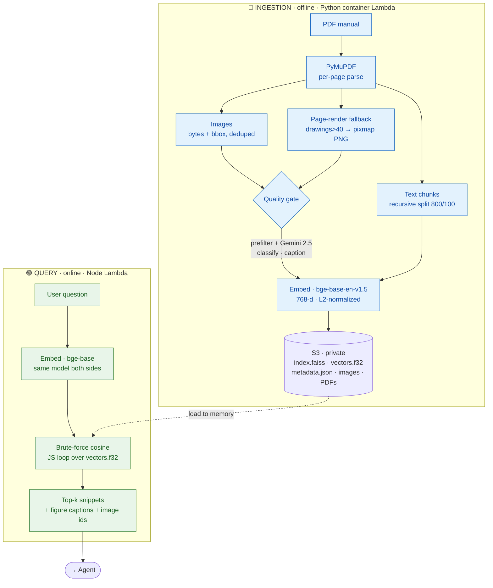

bge-base: embedding model that runs both python (ingest) and node (query).
FAISS and S3: FAISS index is a file in S3, downloaded and searched in memory. we can swap the adaper to opensearch in future. dynamo db not used here beucase it's extra setup which opensearch won't require when we do it. it just becomes an api call. 
dual embed images: caption can be short and vague, page vector is a fallback so figures still on broad queries. currently using the approx first 300-400 tokens of the page text. better idea is to use the nearest text to the image, and if not found then nearest paragraph on 4 sides of the image.
