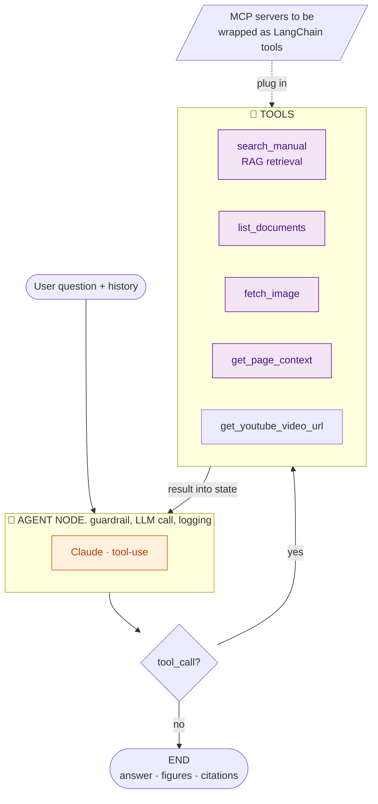

Custom StateGraph: guardrail + logging per node, custom iteration count, more control over agent and more structured. createAgent is not really customizable.
future tools, mcp: add a tool, edit prompt and the model just picks it. MCP tools wrap as LangChain tools and append to the tools array. easily extensible.
