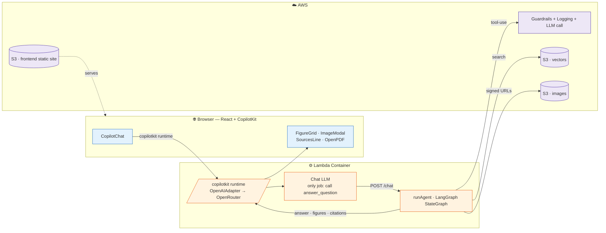

no followUp: don't want the chat LLM to rephrase the answer. agent's answer is what we wanna render. also i was facing issue with 2nd turn groq "unsupported content" bug, but claude didn't have that issue.
streaming the llm steps: CopilotKit CoAgents needs LangGraph as a persistent running server. StateGraph runs in Lambda per request. live streaming couldn't be done for fully serverless.
container lambda: bge-base is in the container itself. replaceable when bedrock is available. 